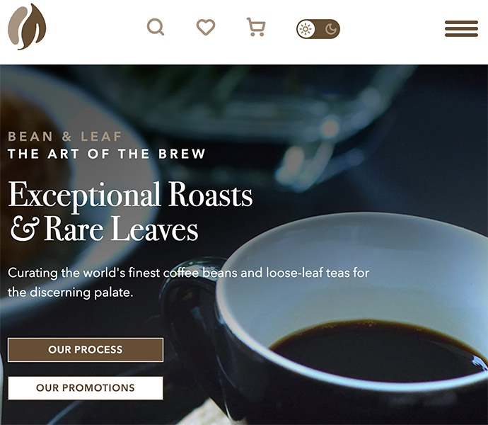

# Bean and Leaf
Bean and Leaf is a fictional company website meant to teach IDP students how to build responsive websites with HTML, CSS and JS.

### Languages: 🛠️ 
JavaScript, HTML5, CSS3
### Frameworks and Libraries: 
GreenSock (To be added)
### Tools: 
Git, Figma
### Technologies: 
Responsive Design

## Features 📋 
  ⚡️ Fully Responsive
  ⚡️ Valid HTML5 & CSS3
  ⚡️ Javascript Carousel, Scroll to Top, and theme selection.

## Installation 📦 
To run the site locally:

- Clone this repository
- Navigate into the project directory:
- Open the index.html file in your browser, or if using a local server, start the server and navigate to localhost to view.

## License 📦 

See License File